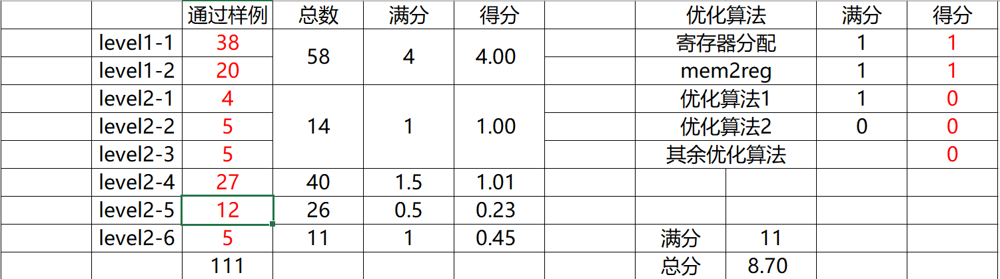

# compiler
Simple C language compiler, which I developed on NKU compiler class.

我在南开大学编译原理课程上所编写的简易C语言（SysY语言）编译器。该任务取材自大学生编译系统能力大赛任务。

最完整的分支为lab7n

# 最终得分情况

# 鸣谢

感谢@Emanual20提供框架

感谢@dingyanfeng和我一道完成实验
